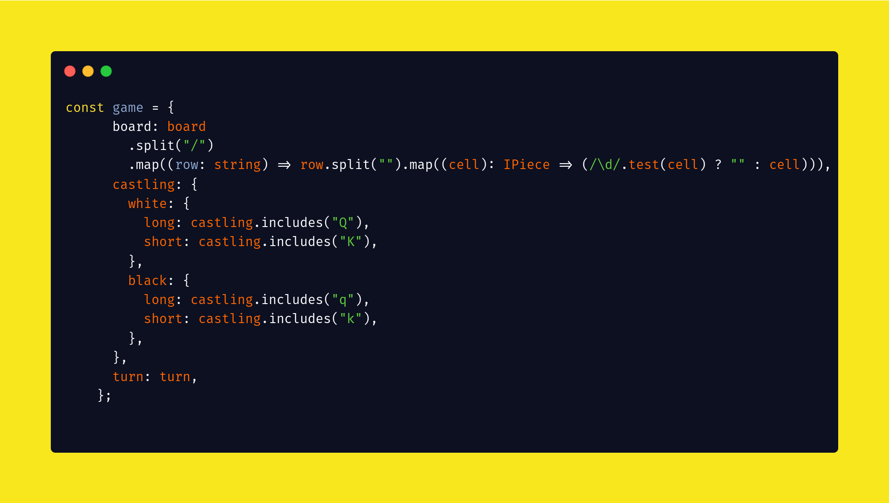

<a name="readme-top"></a>


<br />
<div align="center">
    <a href="">
        
    </a>
    <h3 align="center">
        FEN for deno
    </h3>

  <p align="center">
    Deno module for parsing Forsyth-Edwards Notation expression.
    <br />
    <a href="https://github.com/HackHead/fen/issues">Report Bug</a>
    ·
    <a href="https://github.com/HackHead/fen/issues">Request Feature</a>
  </p>
</div>

<!-- ABOUT THE PROJECT -->
## About The Project
For now, FEN(temp. name) - is a deno module that will help you to convert FEN-expression into a javascript object: 
```javascript
interface IGameState {
  board: Array<Array<string>>;
  castling: {
    white: ICastlingRights;
    black: ICastlingRights;
  };
  turn: string;
  enPassant: null | string;
  movesWithoutCapture: number;
  upcomingMove: number;
}
```
I'm planning to build a complete chess game-engine in the future.



<p align="right">(<a href="#readme-top">back to top</a>)</p>


<!-- CONTRIBUTING -->
## Contributing

If you have a suggestion that would make this better, please fork the repo and create a pull request. You can also simply open an issue with the tag "enhancement".
Don't forget to give the project a star! Thanks again!

1. Fork the Project
2. Create your Feature Branch
3. Commit your Changes
4. Push to the Branch
5. Open a Pull Request

<p align="right">(<a href="#readme-top">back to top</a>)</p>


<!-- LICENSE -->
## License

Distributed under the MIT License. See `LICENSE.txt` for more information.

<p align="right">(<a href="#readme-top">back to top</a>)</p>


<!-- CONTACT -->
## Contact

SolomonAndrew@tutanota.com

[PROJECT LINK](https://github.com/HackHead/fen)

<p align="right">(<a href="#readme-top">back to top</a>)</p>


